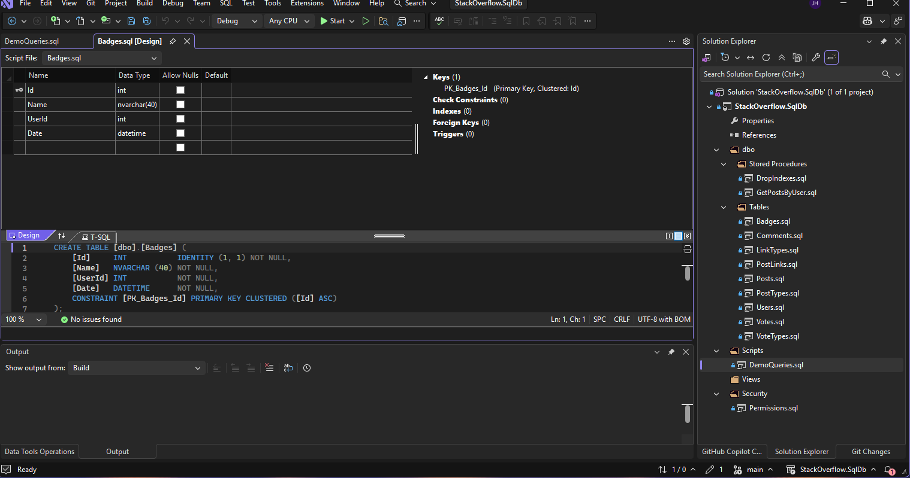

# SQL Server DevOps Lab (DACPAC + CI/CD)

This project demonstrates how to implement modern database DevOps practices using SQL Server Database Projects (SSDT), DACPAC, and CI/CD pipelines.

## Overview

Traditional database deployments rely on manual scripts and are prone to errors.

This project shows how to:
- Treat database schema as source-controlled code
- Automatically build and validate schema changes
- Enable repeatable and reliable deployments using DACPAC

## Architecture

Developer → Git → CI Pipeline → DACPAC → Target Database

## Project Structure

## Technologies Used

- SQL Server
- Visual Studio Community (SSDT)
- DACPAC (Data-tier Application Package)
- Azure DevOps Pipelines
- Git / GitHub
- PowerShell

## How It Works

1. Database schema is defined in the SQL project
2. Changes are committed to source control (Git)
3. CI pipeline builds the project into a DACPAC
4. DACPAC can be deployed to target environments
5. Schema changes are applied in a consistent, repeatable way

## Why This Matters

Traditional database deployments are:
- Manual
- Error-prone
- Hard to track

This project demonstrates how to:
- Automate database builds
- Improve deployment reliability
- Reduce risk in production changes
- Enable DevOps practices for databases

## Future Enhancements

- Add full CI/CD pipeline execution
- Implement automated deployments (CD)
- Add environment-specific configurations
- Integrate database testing
- Expand schema with additional objects

## Notes

This is a personal learning project and does not contain any proprietary or production data.
